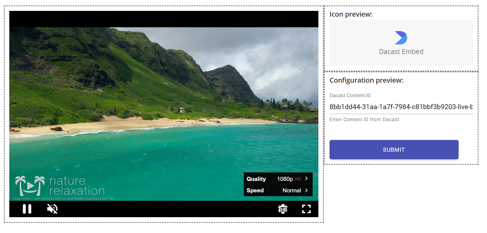

# staffbase-widget-dacast
This custom widget plugin for Staffbase was bootstraped with [@staffbase/create-widget](https://www.npmjs.com/package/@staffbase/create-widget). [Learn more about Staffbase Custom Widgets here.](https://developers.staffbase.com/frameworks/customwidget-development/#custom-widget-development)

# Motivation
The Dacast platform provides 2 mechanisms for embedding its video player in external sites: Via an `<iframe>`, or via a `<script>` tag. Staffbase's built-in embeded content plugin allows editors to load a given URL in an `<iframe>`, but for security it does not permit the use of `<script>` tags in its pages. However, Dacast's [Domain Control](https://www.dacast.com/support/knowledgebase/embedded-video-players) functionality only works from `<script>` embeds. To close this gap, this custom widget provides a simple wrapper for Dacast's `<script>` embedding. This allows Domain Control to limit the player to being loaded only from those domains specified in its configuration; presumably, only from your Staffbase site domain.

The widget accepts a single property: the **Content ID** for a Dacast Player.

# Demo Screenshot


# Installation
See Staffbase's documentation for custom widget installation instructions:
[Installing a Custom Widget to the Staffbase Platform](https://support.staffbase.com/hc/en-us/articles/360021196079-Installing-a-Custom-Widget-to-the-Staffbase-Platform)

# 3rd Party Disclaimer
This is a custom widget intended for installation on an instance of the Staffbase platform by organization administrators. It is **not** an official product of either Staffbase *or* Dacast, and is provided as-is with no warranty or support - use at your own risk. If you encounter problems installing or using the widget that you think may be the result of bugs in the plugin, please open an issue in this repository.

# Development
## Prerequisites
1. Node.js 18 - I use & recommend [fnm](https://github.com/Schniz/fnm) for managing node versions.
2. The Content ID from a Dacast video or livestream channel to test with (Playlist Support Not Yet Tested)

## Development Environment Setup
```bash
$ npm install # Install dependencies
$ npm start # Start the webpack development server
```

## TODO:
- [X] Publish NPM Module
- [X] Fix dynamic sizing headaches
- [X] Explain Staffbase Installation
- [ ] Playlist Support
- [ ] Tests

## Running the app

| Command | Description |
|---|---|
| `npm start` | Starts the development server |
| `npm run build` | Creates the production build |
| `npm run build:watch` | Creates the production build and watch for changes |
| `npm run test` | Runs the unit tests |
| `npm run test:watch` | Runs the unit tests and watches for changes |
| `npm run type-check` | Checks the codebase on type errors |
| `npm run type-check:watch` | Checks the codebase on type errors and watches for changes |
| `npm run lint` | Checks the codebase on style issues |
| `npm run lint:fix` | Fixes style issues in the codebase |


## Building the form for configuration

This project uses [react-jsonschema-form](https://rjsf-team.github.io/react-jsonschema-form/) for configuring the widget properties. For more information consult their [documentation](https://rjsf-team.github.io/react-jsonschema-form/docs/)
